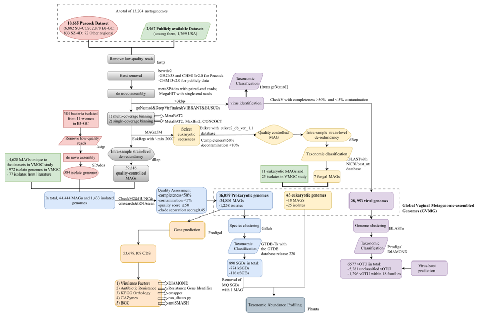

# Analysis of Global Vaginal Microbial Genomes(GVMG)
Here we established an extensive catalog of global vaginal microbial genomes (GVMG) by integrating 10,665 in-house Chinese metagenomes with 2,967 publicly available metagenomes and 1,433 bacterial isolates. This catalog comprised 65,338 genomes from 890 prokaryotes, 11 eukaryotes and 6,590 viral taxonomic units, with many prokaryotes and viruses being not listed in public reference databases.
  
**Link to paper**
https://www.researchgate.net/publication/379595215_Genomic_landscape_in_the_human_vaginal_microbiome_links_to_host_geographics_and_genetics (under review)
  
**Data Availability**  
- The metagenomic data in Peacock Dataset are available in the CNGB Nucleotide Sequence Archive (CNSA: https://db.cngb.org/cnsa) under accession number CNP0005953 and CNP0006125.  
- Vaginal microbial genome database is stored at [](https://doi.org/10.5281/zenodo.14708991):  
    1. krakendb_202408.tar.gz： kraken database -- incorporated 35,915 prokaryotic genomes (spanning 746 SGBs, excluding medium-quality SGBs represented by a single MAG), 43 fungal genomes (spanning 11 fungal species), and the protozoan parasite genome of Trichomonas vaginalis, and the human reference genome (CHM13v2.0).  
    2. Pro_genomes36059.tar.gz: 36,059 prokaryotic genomes.   
    3. proSGB_890.tar.gz: 890 representative genomes of prokaryotic species.  
    4. euk_genomes43.tar.gz: 43 Eukaryotic genome.  
    5. vir_OTU.fa: viral operational taxonomic units (vOTUs).  
  
**Workflow**
   

The detailed steps and software used in the article method, including: assembly and binning, genome quality assessment, SGB clustering and annotation, function annotation, fungal mining, virus assembly mining analysis, kraken2 database construction, species abundance analysis, phenotypic code, SNP analysis, GWAS analysis. We would like to thank DCS Cloud (https://cloud.stomics.tech) for providing the computational resources and software support necessary for this study.

## Genome assembly and binning
Required
```
fastp v0.20.1
bowtie2 v2.4.2
metaSPAdes v3.14.0 (for paired-end reads)
MegaHIT v1.2.9 (for single-end reads)
SPAdes v3.15.2 (for isolate sequences)
MetaBAT2 v2.15
MaxBin2 v2.2.7
CONCOCT v1.1.0
dRep v3.4.9
GRCh38
CHM13v2.0
```
The detailed data quality control and assembly binning steps are listed in the article method. The specific operational steps are outlined below.   
Prepare a list of fastq files(.rmhost.1.fq.gz) that have been quality controlled and removed from the host sequence and store it in the samples_rmhost1.txt file.   
**Step1: Get batch-run assembly command scripts and run**
```
sh ./Assembly_Binning/get_pe_metaspades.sh #output assembly_pe.sh
sh assembly_pe.sh
```
If it is a single-ended sample, store the list of .rmhost.fq.gz in samples_rmhost1.txt:
```
sh ./Assembly_Binning/get_se_megahit.sh #output assembly_se.sh
sh assembly_se.sh
```

**Step2: Prepare the nearest 20 samples for multi-sample binning**
```
ls ./output/assembly/*.scaffolds.fa.gz > scaffolds.fa.gz.list
sh ./Assembly_Binning/get_mash_distance_work.sh  #1000 samples took 20 minutes
Rscript ./Assembly_Binning/get_mash_colest20.R
```
If it is a single-ended sample:
```
ls ./output/assembly/*.contigs.fa.gz > contigs.fa.gz.list
sh ./Assembly_Binning/get_mash_distance_work_se.sh
Rscript ./Assembly_Binning/get_mash_colest20.R
```

**Step3: Multiple sample binning**
```
sh ./Assembly_Binning/get_mulbin_Metabat2_pe.sh #output bin_Metabat2_pe.sh
sh bin_Metabat2_pe.sh
If it is a single-ended sample:
sh ./Assembly_Binning/get_mulbin_Metabat2_se.sh #output bin_Metabat2_se.sh
sh bin_Metabat2_se.sh
```

**Step4: De-redundancy within the sample**
```
dRep dereplicate $sampleid_drep -p 8 -pa 0.9 -sa 0.99 -nc 0.3 --S_algorithm fastANI -comp 50 -con 5 -g $sampleid_binning/*.fa
```

## Genome quality assessment

Required
```
CheckM2 v1.0.1
GUNC v1.06
INFERNAL v1.1.5 (using cmsearch)
tRNAscan-SE v2.0.12
```
prepared all the genomic path that need to be evaluated for quality, as well as the required database (GUNC, rRNA), and used DCS Cloud for calculations.    
For the detailed wdl process, see ./Genomic_quality_assessment/checkm_gunc.wdl, ./Genomic_quality_assessment/infernal_rRNA.wdl, ./Genomic_quality_assessment/tRNAscan.wdl, involving the use of docker environment has been disclosed on the DCS Cloud platform.

## Prokaryotic gene clustering and species annotation
Required
```
Galah v0.4.0
GTDB-Tk v2.4.0 (with GTDB database release 220)
```

**Step1: All prokaryotic genome paths (Pro_mags_genomes.all.path.list) and their evaluation results of checkm2 (checkm2_report.txt), as input files, run the following script and cluster to obtain the species representative genome(SGB)**
```
sh ./Genome_Annotation/galah.sh
```

**Step2: Species classification annotation and phylogenetic tree construction for SGB**
```
sh ./Genome_Annotation/gtdbtk.sh
```

## Functional analysis of prokaryotic genomes

Required
```
Prodigal v2.6.3
DIAMOND v2.1.10
Resistance Gene Identifier (RGI) v6.0.3 
Comprehensive Antibiotic Resistance Database (CARD) v3.2.9
run_dbcan.py v4.1.4 
CAZy Database (CAZyDB.07142024)
emapper v2.1.3
emapperdb v5.0.2
MACREL v1.5.0
BLASTp v2.11.0
antiSMASH v7.1.0
BiG-MAP v1.0.0
```

prepared all the genomic path that need to be evaluated for quality, as well as the required database and used DCS Cloud for calculations.    
For the detailed wdl process, see ./Genomic_Annotation/*.wdl, involving the use of docker environment has been disclosed on the DCS Cloud platform.

## Fungal MAGs

Required
```
EukRep v0.6.7
Eukcc v2.1.0 (with eukcc2_db_ver_1.1 database)
dRep v3.4.0
BLAST v2.11.0 (with NCBI/blast_nt database)
fastANI v1.34
```

**Step1: Screened out of all MAGs obtained by assembly with greater than 3MB and Remove non-eukaryotic contigs in these MAGs, and only MAGs that are still larger than 3MB are retained.**
```
sh ./Fungal_excavation/eukrep.sh
```

**Step2: Fungal MAGs quality assessment**
```
mv *.euk.fa euk_fa
sh ./Fungal_excavation/eukcc.sh
```

**Step3: De-redundancy within the sample**
```
sh ./Fungal_excavation/drep_withinSample.sh
```

**Step4: Select MAGs after quality filtering and redundancy. Taxo Annotation and analysis.**
```
sh ./Fungal_excavation/get_blastn.sh
sh ./Fungal_excavation/get_annotate_work.sh #output work.sh
sh work.sh #need ./Fungal_excavation/getlength.pl and ./Fungal_excavation/mlg.tax.perl
```
## Analysis of the genome for viral populations
Viral population genomes were analyzed using the methodology outlined in the 'Viral genome identification' section of the VMGC pipeline (https://github.com/RChGO/VMGC)
